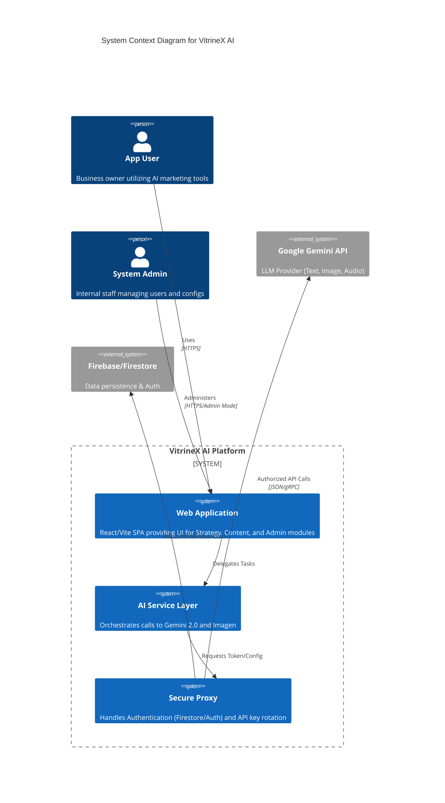
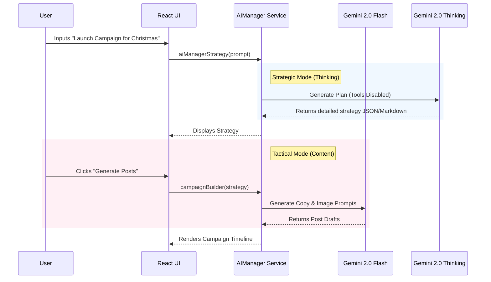

# 📐 System Designs & Diagrams

## 1. High-Level Architecture (C4 Context)

```mermaid
C4Context
    title System Context Diagram for VitrineX AI

    Person(customer, "App User", "Business owner utilizing AI marketing tools")
    Person(admin, "System Admin", "Internal staff managing users and configs")

    System_Boundary(vitrinex, "VitrineX AI Platform") {
        System(webapp, "Web Application", "React/Vite SPA providing UI for Strategy, Content, and Admin modules")
        System(ai_core, "AI Service Layer", "Orchestrates calls to Gemini 2.0 and Imagen")
        System(proxy, "Secure Proxy", "Handles Authentication (Firestore/Auth) and API key rotation")
    }

    System_Ext(google_ai, "Google Gemini API", "LLM Provider (Text, Image, Audio)")
    System_Ext(firebase, "Firebase/Firestore", "Data persistence & Auth")

    Rel(customer, webapp, "Uses", "HTTPS")
    Rel(admin, webapp, "Administers", "HTTPS/Admin Mode")
    Rel(webapp, ai_core, "Delegates Tasks")
    Rel(ai_core, proxy, "Requests Token/Config")
    Rel(proxy, google_ai, "Authorized API Calls", "JSON/gRPC")
    Rel(proxy, firebase, "Reads/Writes User Data")
```

## 2. AI Strategy Generation Flow

```mermaid
sequenceDiagram
    participant User
    participant UI as React UI
    participant Handler as AIManager Service
    participant Gemini as Gemini 2.0 Flash
    participant GeminiThinking as Gemini 2.0 Thinking

    User->>UI: Inputs "Launch Campaign for Christmas"
    UI->>Handler: aiManagerStrategy(prompt)
    
    rect rgb(240, 248, 255)
        note right of Handler: Strategic Mode (Thinking)
        Handler->>GeminiThinking: Generate Plan (Tools Disabled)
        GeminiThinking-->>Handler: Returns detailed strategy JSON/Markdown
    end
    
    Handler-->>UI: Displays Strategy
    
    rect rgb(255, 240, 245)
        note right of Handler: Tactical Mode (Content)
        User->>UI: Clicks "Generate Posts"
        UI->>Handler: campaignBuilder(strategy)
        Handler->>Gemini: Generate Copy & Image Prompts
        Gemini-->>Handler: Returns Post Drafts
    end
    
    Handler-->>UI: Renders Campaign Timeline
```
